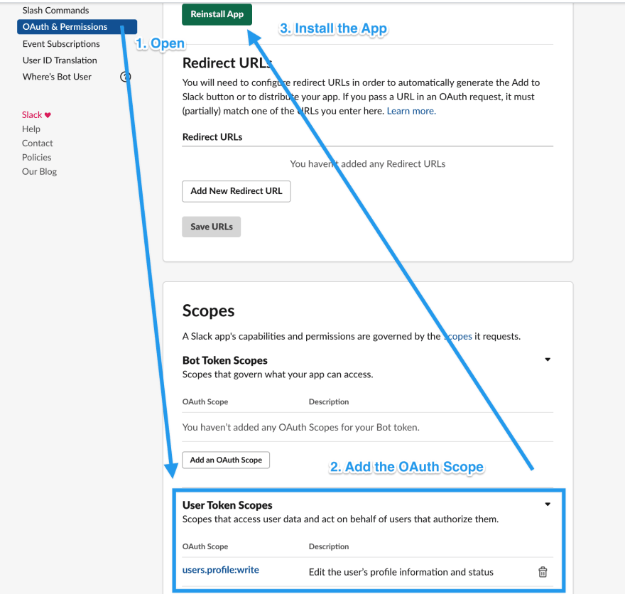
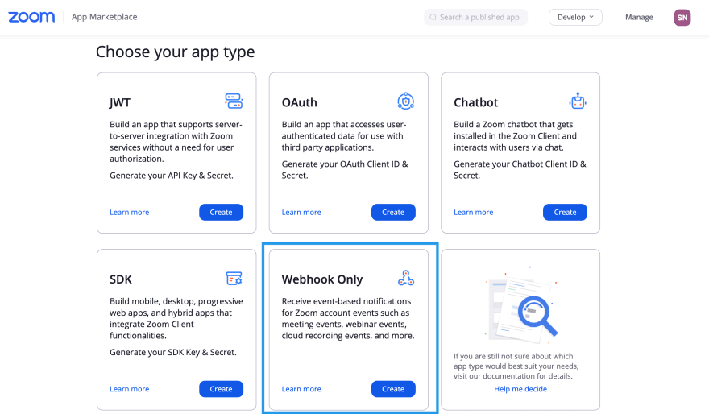
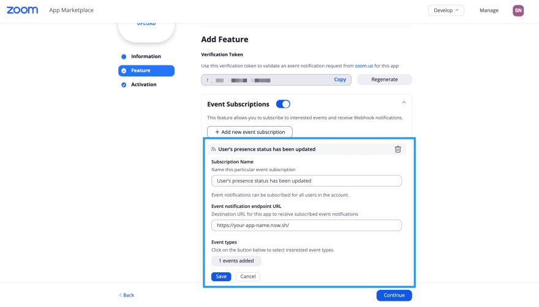

# Zoom Slack Status Updater


[](https://travis-ci.com/natterstefan/zoom-slack-status-updater)
[](https://coveralls.io/github/natterstefan/zoom-slack-status-updater?branch=master)

Update your Slack status automatically when you join a Zoom meeting.

## Requirements

- a Zoom App
- a Slack App
- and a Vercel account

## Development

### Installation

Make sure you have `vercel` and all dependencies installed.

```bash
npm i -g vercel@latest
yarn install # or npm install
```

### Tests

```bash
yarn test
```

## Setup

### Step 1 - Setup Vercel

1. Create a [vercel account](https://vercel.com/signup)
2. Run `vercel login` (login with your vercel account) in your terminal
3. Create a project (either [in the Browser](https://vercel.com/new)) or with
   the CLI (see Step 5 below).

### Step 2 - Setup Slack

1. Create a [Slack App](https://api.slack.com/apps) for your workspace(s)
2. Grant each Slack app the `users.profile:write` **and** `dnd:write` privilege
   in `User Token Scopes` in the `OAuth & Permissions` view, before clicking on
   the "Install App" button.
3. Copy and paste each Slack app's `OAuth Access Token` into the configuration
   file created in the subsequent step.



### Step 3 - Configure Zoom-Slack-Status-Updater App

1. Duplicate [slack-status-config-example.js](./slack-status-config-example.js)
   and rename it to `slack-status-config.js`. This should happen automatically
   thanks to a `postinstall` script.
2. Now you have to create a config object for each slack workspace you want to
   update when a Zoom meeting starts. In the next step you will get to know how
   to add environment variables (for your tokens)

#### Environment Variables

Do not copy and paste your Slack app and other tokens into the
`slack-status-config.js` directly. Instead set up
[environment variables on Vercel](https://vercel.com/docs/environment-variables).

- Step 1 - Open the Project Settings of your Vercel app and select "Environment
  Variables".
- Step 2 - Choose between a **Plaintext** or **Secret** for the tokens. I
  recommend you set up and use **Secret**. Because they are encrypted. Remember
  the name of the Environment variable and add it to the respective workspace in
  the configuration file.
- Step 3 - Now add the Environment variable (e.g.
  `process.env.<enviroment variable name>`) to your configuration file

```js
  {
    name: 'Slack Workspace 1',
    token: process.env.SLACK_TOKEN,
    // see Step 6 for more details about how to obtain this token
    zoomVerificationToken: process.env.VERIFICATION_TOKEN,
    // other configuration settings
  }
```

#### Example configuration

You can add as many Slack workspaces as you want here, just make sure you have
created a Slack app for each workspace.

Here ist the [example configuration](./slack-status-config-example.js).

### Step 5 - Deploy App to Vercel

```bash
# example questions when setting up the now project for the first time
# What’s your project’s name? your-app-name
# In which directory is your code located? ./
vercel
```

This will guide you through the process of creating and deploying the project.
Remember the created Deployment URL. You are going to need it in the next step
for the ZOOM app.

You find the deployment URL in your Project under the "Deployments" tab (example
URL: <https://vercel.com/username/projectname/deployments>) or in the "Settings"
tab and then "Domains"
(<https://vercel.com/username/projectname/settings/domains)>).

Make sure you select the one that looks like: <https://projectname.now.sh/>,
whereas `projectname` is the name of your project. This will point to the latest
deployed version of your app. If you choose another URL you would need to update
Zoom (see Step 6) after each deployment.

### Step 6 - Setup Zoom



[Create a new (or use an existing) "Webhook Only" Zoom app](https://marketplace.zoom.us/develop/create)
with your Zoom account. Even if you added multiple Slack workspaces, you just
need one Zoom app.

Fill out the required information and activate `Event Subscriptions`. Add the
`User’s presence status has been updated` event type. Once you have deployed the
app to now.sh (in a later step) you can add the
`Event notification endpoint URL`.

The `Verification Token` is also visible on this page, you need to add this to
the app configuration in the next step.



You can read more about it setting up the App
[here](https://marketplace.zoom.us/docs/api-reference/webhook-reference/user-events/presence-status-updated).

Add the generated vercel URL from Step 5 as your
`Event notification endpoint URL`.


> A verification token will be generated in the Feature page after you enable
> and save the event subscription. This token can be used to validate the POST
> requests that are sent by Zoom to your event notification endpoint URL.
> ([source](https://marketplace.zoom.us/docs/guides/build/webhook-only-app#features-2))

Get this verification token and add it to the configuration file, see Step 3.

### Step 7 - Run and Test

Now, open both Zoom and Slack and watch the status change when you start or join
a meeting.

You do not need a second account for that. Open Zoom, start a new meeting and
you should see the new status on Slack.

## vercel commands

```bash
# deploy to vercel
vercel

# remove previous deployments
vercel your-app --safe --yes
# deploy and remove previous builds
vercel && vercel rm your-app --safe --yes

# list all deployments
vercel ls
```

## Other solutions

- <https://github.com/cmmarslender/zoom-status>
- <https://github.com/mivok/slack_status_updater> with
  [hammerspoon](http://macappstore.org/hammerspoon/)
- <https://github.com/chrisscott/ZoomSlack>
- [How to automatically update your Slack status with Zapier](https://zapier.com/blog/automate-slack-status/)

## References

- [now.sh examples](https://github.com/zeit/now/tree/master/examples)
- [ZEIT ▲ now for GitHub](https://zeit.co/docs/v2/git-integrations/zeit-now-for-github)
- [Easily Deploy a Serverless Node App with ZEIT Now](https://scotch.io/tutorials/easily-deploy-a-serverless-node-app-with-zeit-now#toc-deploy-application-using-now)
- [Deploying Node.js microservices to ZEIT ▲ Now](https://nodesource.com/blog/deploying-nodejs-microservices-to-ZEIT)
- [Securing persistent environment variables using ZEIT Now](https://humanwhocodes.com/blog/2019/09/securing-persistent-environment-variables-zeit-now/)
- [How to set a Slack status from other apps](https://medium.com/slack-developer-blog/how-to-set-a-slack-status-from-other-apps-ab4eef871339)

## License

[MIT](License)

## Contributors ✨

Thanks goes to these wonderful people
([emoji key](https://allcontributors.org/docs/en/emoji-key)):

<!-- ALL-CONTRIBUTORS-LIST:START - Do not remove or modify this section -->
<!-- prettier-ignore-start -->
<!-- markdownlint-disable -->
<table>
  <tr>
    <td align="center"><a href="http://twitter.com/natterstefan"><br /><sub><b>Stefan Natter</b></sub></a><br /><a href="#ideas-natterstefan" title="Ideas, Planning, & Feedback">🤔</a> <a href="https://github.com/natterstefan/zoom-slack-status-updater/commits?author=natterstefan" title="Code">💻</a></td>
    <td align="center"><a href="https://github.com/ruben-burr"><br /><sub><b>Ruben Burr</b></sub></a><br /><a href="https://github.com/natterstefan/zoom-slack-status-updater/commits?author=ruben-burr" title="Code">💻</a></td>
  </tr>
</table>

<!-- markdownlint-enable -->
<!-- prettier-ignore-end -->

<!-- ALL-CONTRIBUTORS-LIST:END -->

This project follows the
[all-contributors](https://github.com/all-contributors/all-contributors)
specification. Contributions of any kind welcome!
